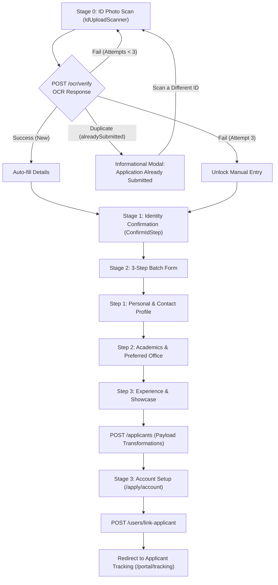

# Applicant Onboarding Workflow Guide

This guide documents the full end-to-end applicant onboarding flow implemented in `/apply` and `/apply/account`.

---

## 🔄 Workflow Steps Overview



---

## 🔒 Stage 0: On-Device OCR ID Verification

1. **Scanner Component (`IdUploadScanner`)**:
   - Lazy-loaded `tesseract.js` chunk to keep initial bundle size small.
   - Captures photo from camera or user file upload.
2. **Backend Processing (`POST /ocr/verify`)**:
   - **New Applicant (Success)**: Returns `studentId`, `firstName`, `lastName`, `middleInitial`, `ocrSessionId`, `manualRequired: false`.
   - **Duplicate Application (`alreadySubmitted: true`)**: If an active application for the scanned Student ID already exists, an **Informational Modal** is presented notifying the applicant to check their personal/QCU email for account setup instructions and status updates. A **"Scan a Different ID"** primary button allows them to reset the scan flow for another ID.
   - **OCR Attempt 1 or 2 Failed (`attemptsRemaining > 0`)**: Returns error message and keeps user on **Scan Stage** to retake/reupload a clearer photo.
   - **OCR Attempt 3 Failed (`attemptsRemaining === 0`)**: Returns `ocrSessionId` with **`manualRequired: true`**, advancing user to manual entry.

---

## ✏️ Stage 1: Identity & Name Confirmation (`ConfirmIdStep`)

- Applicant verifies extracted Student ID (`YY-NNNN`), Full Name, and Personal Email.
- If `manualRequired: true`, all fields unlock so the applicant can type their details manually by hand.

---

## 📋 Stage 2: Compressed 3-Step Batch Form

### Step 1: Personal & Contact Profile
- **Personal**: Date of Birth, Place of Birth, Gender
- **Contact**: Cellphone Number (11 digits), House Address, Facebook Profile Link

### Step 2: Academics
- **Academic & Office**: College, Program *(Filtered dynamically)*, Section, Campus, Preferred Office
- **Required Documents**: Certificate of Registration (COR) & Curriculum Vitae (CV) file uploaders.

### Step 3: Experience & Showcase
- **Background**: Interests/Skills/Hobbies & Past Organizations/Clubs textareas.
- **Showcase**: Portfolio Website URL, GitHub / Project Links, Previous Works & Achievements.

---

## 🛠️ Payload Transformations & Backend Mapping

During form submission (`submit()` in [`src/routes/apply.index.tsx`](../../src/routes/apply.index.tsx)), raw form field values are transformed into backend-compatible `FormData` payloads before sending to `POST /applicants`:

### 1. Preferred Office & Role Mapping (`targetOffice`)
- **UI Source**: Form options in `QUESTIONS` display human-readable `label` strings (e.g., `"Secretariat Office"`, `"Creatives Office"`) from [`OFFICES`](../../src/constants/offices.ts).
- **Backend Requirement**: Backend API & DB schema require UPPERCASE enum string codes (e.g., `"SECRETARIAT_OFFICE"`, `"CREATIVES_OFFICE"`).
- **Transformation Logic**:
  ```typescript
  const targetOffice =
    OFFICES.find((o) => o.value === form.role || o.label === form.role)?.value ??
    "SECRETARIAT_OFFICE";
  fd.append("office", targetOffice);
  ```
- **Why this logic exists**:
  - `o.label === form.role`: Resolves the UI label selected in the dropdown (e.g. `"Secretariat Office"`) to its corresponding enum value (`"SECRETARIAT_OFFICE"`).
  - `o.value === form.role`: Provides backward compatibility if `form.role` already holds an enum value.
  - `?? "SECRETARIAT_OFFICE"`: Provides a safe fallback default if `form.role` is unselected, missing, or invalid.

### 2. Campus & Gender Transformations
- **Campus**: Maps label strings (e.g., `"San Bartolome (Main)"`, `"San Francisco"`, `"Batasan"`) to `SAN_BARTOLOME_MAIN`, `SAN_FRANCISCO`, or `BATASAN`.
- **Gender**: Maps display options (`"Male"`, `"Female"`, `"LGBTQIA+"`, `"Prefer not to say"`) to backend enums (`MALE`, `FEMALE`, `LGBTQIA`, `PREFER_NOT_TO_SAY`).

---

## 👤 Stage 3: Portal Account Setup (`/apply/account`)

- Upon successful submission to `POST /applicants`, applicant data (including `applicantId`) is saved to `sessionStorage`.
- User creates password for their registered personal email.
- Account creation links user login account via `POST /users/link-applicant`.
- Applicant is automatically logged in and redirected to `/portal/tracking`.

