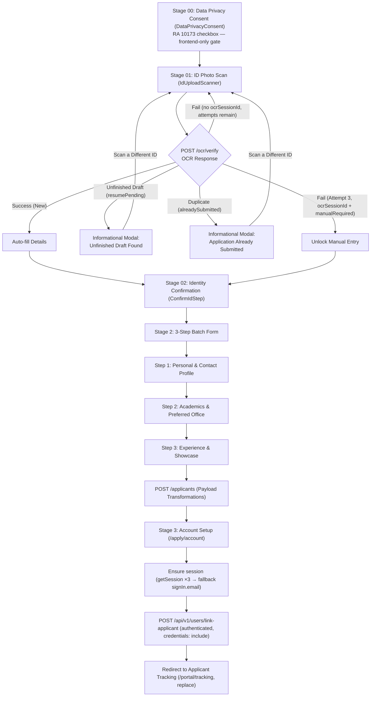

# Applicant Onboarding Workflow Guide

This guide documents the full end-to-end applicant onboarding flow implemented in `/apply` and `/apply/account`.

---

## 🔄 Workflow Steps Overview



---

## 🔐 Stage 03: Session Handshake & Account Linking

Account creation is only considered complete when **all** of the following succeed. Any failure surfaces a blocking error on the form — the user is never navigated to a portal route in a half-created state.

1. **`authClient.signUp.email(...)`** — creates the user with the single-use `setupToken`.
2. **`ensureSession(email, password)`** (`src/routes/apply.account.tsx`) — sign-up does not reliably leave the browser authenticated (`autoSignIn` may be off, and cross-site session cookies are dropped by Safari ITP / Chrome third-party cookie restrictions). This helper polls `authClient.getSession()` up to 3 times with backoff, then falls back to an explicit `authClient.signIn.email(...)`. If no session can be established, the user is told to sign in rather than being bounced silently.
3. **`POST /api/v1/users/link-applicant`** — authenticated (`credentials: "include"`), body is `{ applicantId }` only. `409 Conflict` (already linked) is treated as success; any other non-2xx is a blocking error. This call also sets `emailVerified` server-side, so it must not fail silently.
4. **`setPortalUser(...)`** — populated from the **server session**, not local form state.

The stale `qcumsc.applicant` session-storage entry (which carries the single-use setup token) is cleared on success.

### Portal guard behaviour (`src/components/PortalShell.tsx`)

- The shell holds a `sessionState` of `checking | valid | invalid` and **never** redirects to `/portal/login` while `checking`. This removes the race where a freshly created session had not propagated before the first `getSession()`.
- `getSession()` is retried 3× with backoff; only a definitive failure after all attempts clears the local user and redirects.
- The backend session is authoritative: the localStorage copy is overwritten whenever it disagrees, so a tampered entry cannot grant access to a portal area.
- Sign-out calls `authClient.signOut()` before clearing localStorage, so no live session cookie is left behind on a shared device.
- Guard redirects use `replace: true` so protected routes stay off the back stack.
```

---

## 🛡️ Stage 00: Data Privacy Consent (RA 10173)

- Component: [`src/components/DataPrivacyConsent.tsx`](../../src/components/DataPrivacyConsent.tsx); rendered by `apply.index.tsx` when `stage === "consent"` (the new initial stage).
- Presents a full privacy notice under **Republic Act No. 10173 (Data Privacy Act of 2012)** covering: information collected (ID image, student number, contact details, academic records, COR/CV, application content), purposes of processing (enrollment verification, screening, status transmissions, portal account & membership management, anonymized reporting), disclosure limits, retention, and the data subject's rights.
- **Validation is frontend-only**: the "I Agree — Continue to ID Verification" button stays disabled until the checkbox is ticked; an inline error appears if the user attempts to proceed unchecked. No consent request is sent to the backend.
- On accept, the page transitions to `stage: "scan"` and only then is the OCR scanner (and its lazy `tesseract.js` chunk) reachable.
- **Chunk-load resilience:** the scanner is loaded via `lazyWithRetry()` ([`src/lib/lazy-with-retry.ts`](../../src/lib/lazy-with-retry.ts)) instead of bare `React.lazy`. A dynamic import that fails (`TypeError: Importing a module script failed.`, typically a stale chunk after a redeploy or a flaky network) is retried twice with backoff; if it still fails, the page reloads once (rate-limited to one reload per 30s via `sessionStorage`) so the client picks up the current build. Only after that does the error surface to the error boundary.

---

## 🔒 Stage 01: On-Device OCR ID Verification & Draft Resumption

> **Gate rule:** the Stage 02 confirm / manual-entry form is rendered **only** when the backend returned an `ocrSessionId`. A failed attempt with retries remaining creates no session (`ocrSessionId: null`), so the applicant stays on the scan step. Without this gate the applicant could type their details and then be blocked at submit because the payload had no session.

1. **Scanner Component (`IdUploadScanner`)**:
   - Lazy-loaded `tesseract.js` chunk to keep initial bundle size small.
   - Captures photo from camera or user file upload.
   - Accepts `error` and `busy` props: the error banner renders above the uploader, the confirm button shows **"Verifying…"** while the OCR request is in flight, and a failed attempt resets the uploader so a fresh photo must be chosen.
2. **Backend Processing (`POST /ocr/verify`)**:
   - **New Applicant (Success)**: Returns `studentId`, `firstName`, `lastName`, `middleInitial`, `ocrSessionId`, `manualRequired: false`. Name fields are editable; `studentId` is authoritative from the server.
   - **Unfinished Draft (`resumePending: true`)**: If an unfinished draft exists for the scanned Student ID, the backend dispatches a 30-minute secure resume link email (`/apply?resumeToken=...`) and returns `resumePending: true`. The frontend displays an **"Unfinished Draft Found!"** modal with a **"Scan a Different ID"** button. No form is shown.
   - **Duplicate Application (`alreadySubmitted: true`)**: An **Informational Modal** is presented notifying the applicant to check their personal/QCU email for account setup instructions and status updates. No form is shown.
   - **OCR Attempt 1 or 2 Failed (`attemptsRemaining > 0`, `ocrSessionId: null`)**: **No session is created.** The user stays on the **Scan Stage**; an amber banner shows the sanitized error plus *"You have N attempts left."* and the uploader resets for a retake. The confirm/manual form is not shown.
   - **OCR Attempt 3 Failed (`attemptsRemaining === 0`)**: Returns an `ocrSessionId` with **`manualRequired: true`**, advancing the user to manual entry with every field (including `studentId`) editable.
   - **Network / parse failure**: Treated as "no session" — the user stays on the Scan Stage with the error banner.

3. **Cross-Device Draft Rehydration (`?resumeToken=...`)**:
   - **Accepted link shapes:** the canonical link is `/apply?resumeToken=<jwt>`. Because the backend email previously pointed at a path the app had no route for (producing a hard 404), the frontend now also accepts `/apply?token=<jwt>` and `/apply/resume?token=<jwt>` / `/apply/resume?resumeToken=<jwt>`. [`src/routes/apply.resume.tsx`](../../src/routes/apply.resume.tsx) is a redirect-only alias route (`beforeLoad` throws `redirect({ to: "/apply", search: { resumeToken }, replace: true })`), and `/apply`'s `validateSearch` treats `token` as an alias for `resumeToken`.
   - When an applicant clicks the resume link in their email, the frontend sends `POST /api/v1/applicants/draft/resume` with `{ token }`.
   - **Response shape:** the backend wraps the record as `{ success, data: { draft: { … } } }` — a flat draft row (`id`, `currentStep`, `ocrSessionId`, plus every saved field), *not* `{ form, currentStep }`. The frontend reads `json.data.draft` (falling back to `json.data`); reading `json.data` alone left every field empty.
   - **Rehydration mapping:** `draft.id` → `draftId` (so subsequent batch PATCHes target the same draft), backend enums are mapped back to UI labels (`FEMALE` → "Female", `SAN_BARTOLOME_MAIN` → "San Bartolome (Main)", `SECRETARIAT_OFFICE` → "Secretariat Office"), `dateOfBirth` is truncated from ISO datetime to `YYYY-MM-DD` for the date input, and `lastName/firstName/middleInitial` are recombined into the `"Last, First M."` display name.
   - **Step mapping:** `currentStep` counts *saved* batches (`0` = only Batch 0 done), so the form opens at `currentStep + 1` (clamped to 1–3). Opening on the already-saved step made the next batch PATCH fail with "draft is at wrong step".
   - The frontend rehydrates the state, transitions directly to the saved step in `stage: "form"`, displays a welcome toast, and clears `resumeToken` from the URL.

   - **Single-use guarantee:** the token is consumed exactly once. `consumedResumeTokenRef` records the token before the request is issued (guarding remount / HMR / effect re-runs), and [`src/lib/resume-token.ts`](../../src/lib/resume-token.ts) additionally records it in `sessionStorage` so a **full page reload** (refresh, back button, email client re-opening the tab) cannot replay a spent token. Both the success and failure paths navigate with `search: {}`, so `?resumeToken=` is stripped from the URL and can never be redeemed twice. Without these two guarantees the replayed token was rejected by the backend and the applicant fell back to the default `stage: "consent"` — the "looping back through the application" bug. See [`docs/fix/resume-link-loop-fix.md`](../fix/resume-link-loop-fix.md).
   - **Failure is visible, not silent:** a failed resume sets `resumeError` and renders a dedicated modal instead of dropping the applicant on the consent screen. `400`/`404` (invalid, expired, already used, draft gone) → "This resume link has expired" with a *Scan your ID to continue* action; `AbortError` → timeout copy; anything else → the API message. Re-scanning after the 30-minute cooldown issues a **fresh** link to the *same* draft at the *same* saved step — no duplicate application, no lost progress.
   - **Timeout guard:** the resume POST is aborted after 25s (`AbortController`), showing "Resuming your draft timed out. Please open the link again."
   - **Visible state:** while the draft is being fetched, `/apply` renders `<CosmicLoader label="Resuming your application draft" />` (previously `rehydratingDraft` was tracked but never rendered).

   - Verified end-to-end against a stubbed `/api/v1/applicants/draft/resume`: `/apply?token=<jwt>` issues one POST, lands on `/apply` with the query string cleared, and renders the saved step with the draft's fields pre-filled.
   - **Console `404` on the emailed link is a hosting artifact, not a routing bug.** `dev.msc-qcu.tech` is served from an Azure Storage static website (`x-ms-error-code: WebContentNotFound`), which ignores `staticwebapp.config.json`; every deep link (`/apply`, `/portal/login`, `/apply/resume?...`) is served through the error document, so the SPA shell renders correctly but the document response carries HTTP 404. Live re-test of the emailed link redirects to `/apply` and rehydrates the draft successfully. To make hosting return the shell for deep links, `bun run build:swa` now also emits `dist/client/index.html` and `dist/client/404.html` (copies of `_shell.html`) via [`scripts/emit-spa-fallback.mjs`](../../scripts/emit-spa-fallback.mjs); the storage account's index/error document settings must point at those files.


---

## ✏️ Stage 02: Identity & Name Confirmation (`ConfirmIdStep`)

- Applicant verifies extracted Student ID (`YY-NNNN`), Full Name, and Personal Email.
- If `manualRequired: true`, all fields unlock so the applicant can type their details manually by hand.
- **Draft Creation (`POST /api/v1/applicants/draft`)**: When the applicant clicks **Continue**, the frontend sends `POST /api/v1/applicants/draft` with `{ lastName, firstName, middleInitial, email, ocrSessionId }` to persist Batch 0 draft data to the database and receive a `draftId`. Any duplicate application errors (`409 Conflict`) are caught and displayed on this step.

---

## 📋 Stage 2: Compressed 3-Step Batch Form

### Step 1: Personal & Contact Profile
- **Personal**: Date of Birth, Place of Birth, Gender
- **Contact**: Cellphone Number (11 digits), House Address, Facebook Profile Link
- **Batch 1 Auto-Save**: Clicking **Next Step** calls `PATCH /api/v1/applicants/draft/:draftId/batch-1` to persist personal info in database (`currentStep: 1`).

### Step 2: Academics & Document Uploads
- **Academic & Office**: College, Program *(Filtered dynamically)*, Section, Campus, Preferred Office
- **Required Documents**: Certificate of Registration (COR) & Curriculum Vitae (CV) file uploaders.
- **Batch 2 Auto-Save**: Clicking **Next Step** calls `PATCH /api/v1/applicants/draft/:draftId/batch-2` (`FormData`) to save academic info and upload COR & CV files to the server (`currentStep: 2`).
- **Attachment durability** (see [`docs/fix/stale-attachment-fix.md`](../fix/stale-attachment-fix.md)):
  - Picked `File` handles are probed for readability every 30s while Step 2 is open and again just before upload. A dead handle clears only that field and asks the applicant to choose the file again — all other answers are preserved.
  - Once the backend has stored the batch (`savedStep >= 2`), documents already on the server count as present, and **Next Step** advances without re-sending `batch-2` (which would return `400 draft is at wrong step`).
  - Answers, current step, `draftId`, `ocrSessionId` and saved document names persist in `sessionStorage` (24h TTL) so a reload resumes in place; raw files are never persisted because the server copy is authoritative.

### Step 3: Experience, Showcase & Final Submission
- **Background**: Interests/Skills/Hobbies & Past Organizations/Clubs textareas.
- **Showcase**: Portfolio Website URL, GitHub / Project Links, Previous Works & Achievements.
- **Batch 3 Final Submit**: Clicking **Submit Application** calls `POST /api/v1/applicants/draft/:draftId/submit` to merge all draft data, create the active `Applicant` record in the database, and issue a setup token email.

### Submit guard (double-click protection)

The Step 3 primary action performs a multi-second multipart upload (COR + CV) followed by a redirect to `/apply/account`. To prevent duplicate applications from impatient repeat clicks:

- `submit()` in [`src/routes/apply.index.tsx`](../../src/routes/apply.index.tsx) is protected by a `submitLockRef` ref guard — a second invocation in the same tick returns immediately, before any `FormData` is built or any request is sent.
- An `isSubmitting` state disables both **Submit Application** and **Previous Step**, sets `aria-busy`, and swaps the button label to **"Submitting…"** with a spinning indicator, so the button itself communicates the in-flight state.
- The lock stays held through a successful `POST /applicants` and the subsequent navigation, so the button never re-arms during the redirect.
- Before navigating, `submit()` calls `startAccountRedirect()` (see [`src/lib/application-flow.ts`](../../src/lib/application-flow.ts)) and flips local `redirectingToAccount` state. `/apply` then renders the **Account Redirect** screen instead of its default `stage: "consent"` view, so the Data Privacy step can never flash for a frame if the page re-mounts while `/apply/account` loads. The 15s TTL marker is cleared by `/apply/account` on mount, and by `clearAccountRedirect()` if submission fails.
- On failure the lock and `isSubmitting` are released, the redirect marker is cleared, the error is shown at the top of the form, and the applicant may retry.


---

## 🛠️ Payload Transformations & Backend Mapping

During form submission (`submit()` in [`src/routes/apply.index.tsx`](../../src/routes/apply.index.tsx)), raw form field values are transformed into backend-compatible `FormData` payloads before sending to `POST /applicants`:

### 1. Preferred Office & Role Mapping (`targetOffice`)
- **UI Source**: Form options in `QUESTIONS` display human-readable `label` strings (e.g., `"Secretariat Office"`, `"Creatives Office"`) from [`OFFICES`](../../src/constants/offices.ts).
- **Backend Requirement**: Backend API & DB schema require UPPERCASE enum string codes (e.g., `"SECRETARIAT_OFFICE"`, `"CREATIVES_OFFICE"`).
- **Transformation Logic**:
  ```typescript
  const targetOffice =
    OFFICES.find((o) => o.value === form.role || o.label === form.role)?.value ??
    "SECRETARIAT_OFFICE";
  fd.append("office", targetOffice);
  ```
- **Why this logic exists**:
  - `o.label === form.role`: Resolves the UI label selected in the dropdown (e.g. `"Secretariat Office"`) to its corresponding enum value (`"SECRETARIAT_OFFICE"`).
  - `o.value === form.role`: Provides backward compatibility if `form.role` already holds an enum value.
  - `?? "SECRETARIAT_OFFICE"`: Provides a safe fallback default if `form.role` is unselected, missing, or invalid.

### 2. Campus & Gender Transformations
- **Campus**: Maps label strings (e.g., `"San Bartolome (Main)"`, `"San Francisco"`, `"Batasan"`) to `SAN_BARTOLOME_MAIN`, `SAN_FRANCISCO`, or `BATASAN`.
- **Gender**: Maps display options (`"Male"`, `"Female"`, `"LGBTQIA+"`, `"Prefer not to say"`) to backend enums (`MALE`, `FEMALE`, `LGBTQIA`, `PREFER_NOT_TO_SAY`).

---

## 👤 Stage 3: Portal Account Setup (`/apply/account`)

Account setup requires the single-use, server-signed **`setupToken`**; `POST /api/auth/sign-up/email` rejects requests without one. **Only `POST /api/v1/applicants` (the one-shot fallback) returns a token in its response** — `POST /api/v1/applicants/draft/:draftId/submit` returns `{ id, status }` only and delivers the token exclusively by email (`apidocs/applicants.md` § 6.4). Since the real form always submits through the draft endpoint, the normal path is email-driven.

### No token in this browser (the normal draft path)

- `/apply` stores `{ applicantId, email, studentId, name fields }` in `sessionStorage` (`qcumsc.applicant`) — **no `setupToken`** — and navigates to `/apply/account` with `search: {}` after `startAccountRedirect()`.
- `/apply/account` renders [`SetupLinkSent`](../../src/components/SetupLinkSent.tsx) instead of the password form: submission confirmed, the target email shown, spam-folder and 48-hour single-use notes, a **Resend setup link** action (`POST /api/v1/applicants/resend-setup-link`), and a sign-in link for applicants who already have an account.
- Resend is guarded by an in-flight ref lock plus a 60-second visible cooldown so the endpoint's rate limit is respected client-side; a `429` shows a wait message and starts the cooldown.
- The password form is never shown without a token, which removes the old failure where the applicant typed a password and was rejected with "Setup token is missing". See [`docs/fix/setup-token-missing-fix.md`](../fix/setup-token-missing-fix.md).

### With a token (emailed link, or the one-shot fallback endpoint)

- `/auth/setup-password?token=…` and `/apply/account?token=…` validate through `POST /api/v1/users/validate-setup-token`, then render the password form pre-filled from the validated applicant record.
- Validation runs **once per token** (`validatedTokenRef` guards remounts / double-effect runs) and is `AbortController`-cancelled with a 20s timeout, so tabs left open never re-hit or hold the backend.
- On submit: `authClient.signUp.email({ …, setupToken })` → `ensureSession()` → `POST /api/v1/users/link-applicant` → `setPortalUser()` → redirect to `/portal/tracking` (see Stage 03 handshake above). The stale `qcumsc.applicant` entry is cleared on success.
- Invalid / expired / already-used tokens render the "Setup Link Expired" or "Account Already Created" state — never a silent bounce back into the application.


