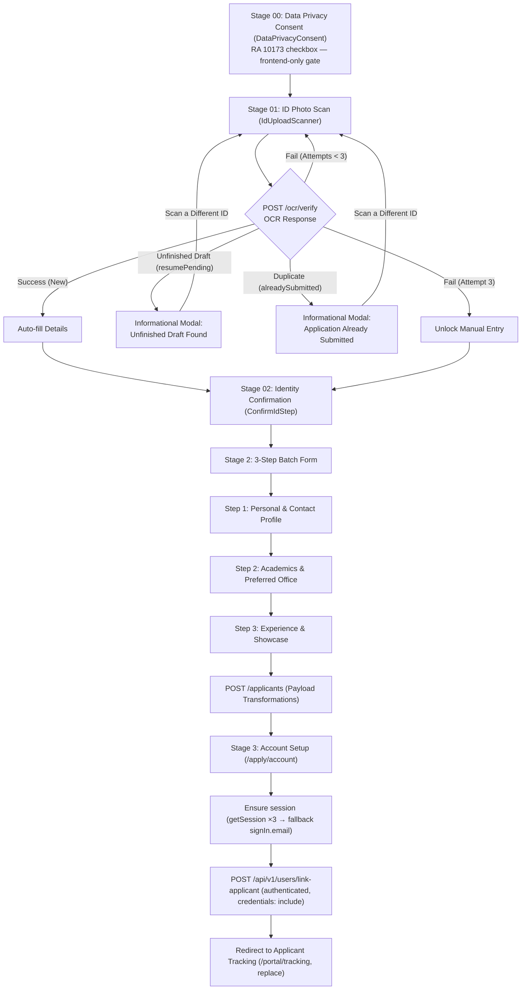

# Applicant Onboarding Workflow Guide

This guide documents the full end-to-end applicant onboarding flow implemented in `/apply` and `/apply/account`.

---

## 🔄 Workflow Steps Overview



---

## 🔐 Stage 03: Session Handshake & Account Linking

Account creation is only considered complete when **all** of the following succeed. Any failure surfaces a blocking error on the form — the user is never navigated to a portal route in a half-created state.

1. **`authClient.signUp.email(...)`** — creates the user with the single-use `setupToken`.
2. **`ensureSession(email, password)`** (`src/routes/apply.account.tsx`) — sign-up does not reliably leave the browser authenticated (`autoSignIn` may be off, and cross-site session cookies are dropped by Safari ITP / Chrome third-party cookie restrictions). This helper polls `authClient.getSession()` up to 3 times with backoff, then falls back to an explicit `authClient.signIn.email(...)`. If no session can be established, the user is told to sign in rather than being bounced silently.
3. **`POST /api/v1/users/link-applicant`** — authenticated (`credentials: "include"`), body is `{ applicantId }` only. `409 Conflict` (already linked) is treated as success; any other non-2xx is a blocking error. This call also sets `emailVerified` server-side, so it must not fail silently.
4. **`setPortalUser(...)`** — populated from the **server session**, not local form state.

The stale `qcumsc.applicant` session-storage entry (which carries the single-use setup token) is cleared on success.

### Portal guard behaviour (`src/components/PortalShell.tsx`)

- The shell holds a `sessionState` of `checking | valid | invalid` and **never** redirects to `/portal/login` while `checking`. This removes the race where a freshly created session had not propagated before the first `getSession()`.
- `getSession()` is retried 3× with backoff; only a definitive failure after all attempts clears the local user and redirects.
- The backend session is authoritative: the localStorage copy is overwritten whenever it disagrees, so a tampered entry cannot grant access to a portal area.
- Sign-out calls `authClient.signOut()` before clearing localStorage, so no live session cookie is left behind on a shared device.
- Guard redirects use `replace: true` so protected routes stay off the back stack.
```

---

## 🛡️ Stage 00: Data Privacy Consent (RA 10173)

- Component: [`src/components/DataPrivacyConsent.tsx`](../../src/components/DataPrivacyConsent.tsx); rendered by `apply.index.tsx` when `stage === "consent"` (the new initial stage).
- Presents a full privacy notice under **Republic Act No. 10173 (Data Privacy Act of 2012)** covering: information collected (ID image, student number, contact details, academic records, COR/CV, application content), purposes of processing (enrollment verification, screening, status transmissions, portal account & membership management, anonymized reporting), disclosure limits, retention, and the data subject's rights.
- **Validation is frontend-only**: the "I Agree — Continue to ID Verification" button stays disabled until the checkbox is ticked; an inline error appears if the user attempts to proceed unchecked. No consent request is sent to the backend.
- On accept, the page transitions to `stage: "scan"` and only then is the OCR scanner (and its lazy `tesseract.js` chunk) reachable.

---

## 🔒 Stage 01: On-Device OCR ID Verification & Draft Resumption


1. **Scanner Component (`IdUploadScanner`)**:
   - Lazy-loaded `tesseract.js` chunk to keep initial bundle size small.
   - Captures photo from camera or user file upload.
2. **Backend Processing (`POST /ocr/verify`)**:
   - **New Applicant (Success)**: Returns `studentId`, `firstName`, `lastName`, `middleInitial`, `ocrSessionId`, `manualRequired: false`.
   - **Unfinished Draft (`resumePending: true`)**: If an unfinished draft exists for the scanned Student ID, the backend dispatches a 30-minute secure resume link email (`/apply?resumeToken=...`) and returns `resumePending: true`. The frontend displays an **"Unfinished Draft Found!"** modal with a **"Scan a Different ID"** button.
   - **Duplicate Application (`alreadySubmitted: true`)**: If an active application for the scanned Student ID already exists, an **Informational Modal** is presented notifying the applicant to check their personal/QCU email for account setup instructions and status updates.
   - **OCR Attempt 1 or 2 Failed (`attemptsRemaining > 0`)**: Returns error message and keeps user on **Scan Stage** to retake/reupload a clearer photo.
   - **OCR Attempt 3 Failed (`attemptsRemaining === 0`)**: Returns `ocrSessionId` with **`manualRequired: true`**, advancing user to manual entry.
3. **Cross-Device Draft Rehydration (`?resumeToken=...`)**:
   - When an applicant clicks the resume link in their email (`/apply?resumeToken=<token>`), the frontend sends `POST /api/v1/applicants/draft/resume` with `{ token }`.
   - The backend validates the JWT and returns the draft payload (`form`, `currentStep`, `ocrSessionId`).
   - The frontend rehydrates the state, transitions directly to the saved step in `stage: "form"`, displays a welcome toast, and clears `resumeToken` from the URL.

---

## ✏️ Stage 02: Identity & Name Confirmation (`ConfirmIdStep`)

- Applicant verifies extracted Student ID (`YY-NNNN`), Full Name, and Personal Email.
- If `manualRequired: true`, all fields unlock so the applicant can type their details manually by hand.

---

## 📋 Stage 2: Compressed 3-Step Batch Form

### Step 1: Personal & Contact Profile
- **Personal**: Date of Birth, Place of Birth, Gender
- **Contact**: Cellphone Number (11 digits), House Address, Facebook Profile Link

### Step 2: Academics
- **Academic & Office**: College, Program *(Filtered dynamically)*, Section, Campus, Preferred Office
- **Required Documents**: Certificate of Registration (COR) & Curriculum Vitae (CV) file uploaders.

### Step 3: Experience & Showcase
- **Background**: Interests/Skills/Hobbies & Past Organizations/Clubs textareas.
- **Showcase**: Portfolio Website URL, GitHub / Project Links, Previous Works & Achievements.

---

## 🛠️ Payload Transformations & Backend Mapping

During form submission (`submit()` in [`src/routes/apply.index.tsx`](../../src/routes/apply.index.tsx)), raw form field values are transformed into backend-compatible `FormData` payloads before sending to `POST /applicants`:

### 1. Preferred Office & Role Mapping (`targetOffice`)
- **UI Source**: Form options in `QUESTIONS` display human-readable `label` strings (e.g., `"Secretariat Office"`, `"Creatives Office"`) from [`OFFICES`](../../src/constants/offices.ts).
- **Backend Requirement**: Backend API & DB schema require UPPERCASE enum string codes (e.g., `"SECRETARIAT_OFFICE"`, `"CREATIVES_OFFICE"`).
- **Transformation Logic**:
  ```typescript
  const targetOffice =
    OFFICES.find((o) => o.value === form.role || o.label === form.role)?.value ??
    "SECRETARIAT_OFFICE";
  fd.append("office", targetOffice);
  ```
- **Why this logic exists**:
  - `o.label === form.role`: Resolves the UI label selected in the dropdown (e.g. `"Secretariat Office"`) to its corresponding enum value (`"SECRETARIAT_OFFICE"`).
  - `o.value === form.role`: Provides backward compatibility if `form.role` already holds an enum value.
  - `?? "SECRETARIAT_OFFICE"`: Provides a safe fallback default if `form.role` is unselected, missing, or invalid.

### 2. Campus & Gender Transformations
- **Campus**: Maps label strings (e.g., `"San Bartolome (Main)"`, `"San Francisco"`, `"Batasan"`) to `SAN_BARTOLOME_MAIN`, `SAN_FRANCISCO`, or `BATASAN`.
- **Gender**: Maps display options (`"Male"`, `"Female"`, `"LGBTQIA+"`, `"Prefer not to say"`) to backend enums (`MALE`, `FEMALE`, `LGBTQIA`, `PREFER_NOT_TO_SAY`).

---

## 👤 Stage 3: Portal Account Setup (`/apply/account`)

- Upon successful submission to `POST /applicants`, applicant data (including `applicantId`) is saved to `sessionStorage`.
- User creates password for their registered personal email.
- Account creation links user login account via `POST /users/link-applicant`.
- Applicant is automatically logged in and redirected to `/portal/tracking`.

