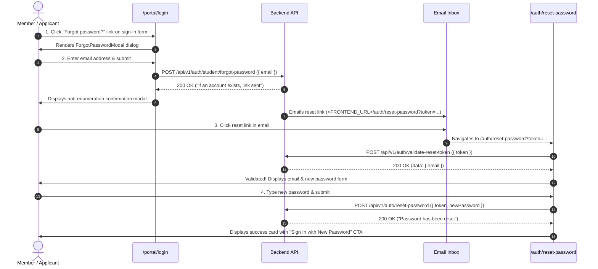

# Password Reset & Account Recovery Workflow Guide

This guide documents the end-to-end Password Reset and Forgot Password workflow implemented on the frontend across [`src/routes/portal.login.tsx`](../../src/routes/portal.login.tsx) and [`src/routes/auth.reset-password.tsx`](../../src/routes/auth.reset-password.tsx).

---

## 🔄 Workflow Overview

---

## 🔑 Key Features & Design System

### 1. Anti-Enumeration Security
- On request submit (`POST /api/v1/auth/student/forgot-password`), the frontend displays the exact generic message returned by the server:
  > *"If an account exists, a password reset link has been sent."*
- This prevents callers from guessing which email addresses are registered in the portal.

### 2. Token Validation & Expiry
- Moving to `/auth/reset-password?token=...` automatically triggers `POST /api/v1/auth/validate-reset-token` on mount.
- If the token is invalid, expired, or already consumed, an error card is presented prompting the user to request a fresh link.

### 3. Session Invalidation
- When a new password is set via `POST /api/v1/auth/reset-password`, the backend invalidates all existing sessions.
- The user must sign in again using their new password on `/portal/login`.

---

## 🎨 UI Interaction Rules

- The **Forgot password?** trigger link is positioned immediately below the Password input field (aligned right) on the sign-in form ([`src/routes/portal.login.tsx`](../../src/routes/portal.login.tsx)).
- The password visibility eye toggle dynamically renders inside the password input field when text is entered into the field (displaying `EyeOff` slashed eye when hidden, and `Eye` open eye when revealed).
- All interactive buttons (**Forgot password?**, **Close**, **Cancel**, **Send reset link**, **Sign In with New Password**) feature explicit `cursor-pointer` styles on hover.
- While async requests are pending, buttons enter a disabled loading state (`submittingStep || sending || submitting`), displaying an animated spinner (`Loader2`) and `cursor-not-allowed`.
